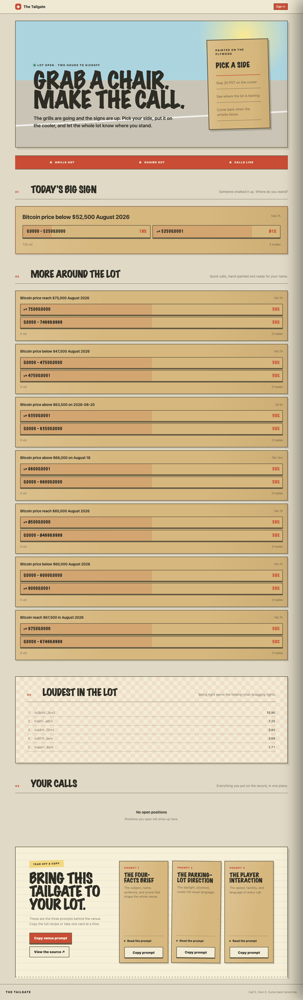

# The Tailgate

A player-first Prophecy prediction venue designed like a stadium parking lot two hours before
kickoff: daylight, grills going, folding chairs, hand-painted plywood signs, and calls made on a
cooler lid.

The venue currently uses temporary Bitcoin, Ethereum, and Solana markets on Somnia testnet. Its
market content remains data-driven so NFL markets can replace that scope later without changing the
design or trading flow.



## What is included

- A featured “big sign” followed by a short, mobile-first market list
- Prophecy-powered live prices, market details, positions, and checkout
- A compact “Who called it?” top-holders section
- Comments, recent activity, resolution receipts, and Caliber criteria
- A player leaderboard framed as parking-lot bragging rights
- A “Copy venue” section containing the prompts used to recreate the experience
- Desktop, mobile, and market-detail screenshots in `shots/`

See [PROPHECY_COMPONENTS.md](PROPHECY_COMPONENTS.md) for the complete component and capability map.

## Requirements

- Node.js 18 or newer
- npm
- A Prophecy npm access key for the restricted `@prophecy-dev/*` packages
- A Privy app configured for Somnia testnet if you want to test login and trading

Configure npm authentication without committing the token:

```bash
export NPM_TOKEN=<your-prophecy-npm-key>
```

The scaffolded `.npmrc` reads this environment variable and is ignored by Git.

## Run locally

```bash
npm install
npm run dev
```

Open [http://localhost:3000](http://localhost:3000).

The current Privy app must allow the exact local origin, including the port.

## Verify the venue

```bash
npm run typecheck
npm run validate
npm run build
npm run shot
```

`validate` checks the Prophecy integration and reports the live market scope. `shot` renders
`shots/desktop.png` and `shots/mobile.png`; it requires Playwright and Chromium to be available to
the Prophecy CLI.

## Change the market scope

The venue's market view lives in [`app/venue-markets.ts`](app/venue-markets.ts):

```ts
const VENUE_QUERY = "bitcoin"
const VENUE_TERMS = ["bitcoin", "ethereum", "solana"]
```

When NFL testnet markets become available:

1. Replace the query and terms with words appearing in their exact market titles.
2. Run `npm run validate`.
3. Do not continue if the scope report says `ON THE BOARD: 0`.
4. Regenerate and inspect the screenshots.

Search matches market titles rather than broad topics. Team and player names are usually better
terms than `NFL` or `American sports`.

## Project structure

```text
app/
  page.tsx                    Homepage, leaderboard, positions, and copy prompts
  venue-markets.ts            Venue-scoped market search
  providers.tsx               Connect, Privy, theme, and checkout providers
  m/[id]/market-view.tsx      Market detail, holders, comments, and resolution
  globals.css                 Tailgate visual system
PROPHECY_COMPONENTS.md        Prophecy capability documentation
shots/                        Generated visual checks
```

## Prophecy integration rule

> Restyle and restructure freely. Never rewire.

Pricing, market truth, positions, resolution, and trading stay inside Prophecy Connect and Venue
Kit. The venue never calculates prices, posts trades directly, or replaces the checkout flow.

## Vercel deployment

The production venue is available at [the-tailgate.vercel.app](https://the-tailgate.vercel.app).

The project preserves Vinext for Prophecy's Cloudflare deployment path and adds a native Next.js
build for Vercel:

```bash
npm run build:vercel
vercel deploy --prebuilt --prod
```

Vercel uses the Next.js framework preset and `npm run build:vercel`. Add `NPM_TOKEN` to the Vercel
project's build environment because the tracked `.npmrc` references it when installing Prophecy's
restricted packages. Never put the token itself in the repository.

## Venue registration

The local build intentionally has no venue key yet. Register it when you are ready:

```bash
prophecy venue create "The Tailgate"
```

The command prints the venue's `pck_…` key once. Follow the
[Prophecy launch guide](https://docs.prophecyhosting.com/launch-a-venue.txt) to configure and deploy
it.

## Documentation

- [Prophecy Connect](https://docs.prophecyhosting.com/welcome)
- [Make a venue](https://docs.prophecyhosting.com/make-a-venue)
- [Prompt to venue](https://docs.prophecyhosting.com/prompt-to-venue)
- [Component usage in this project](PROPHECY_COMPONENTS.md)
